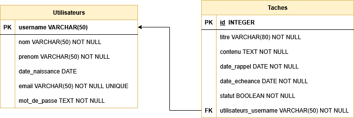

# Prérequis : création de la DB
Dans cette seconde remise, vous enregistrerez vos données dans une base de données.
Le prérequis est donc de bien lire le document qui vous a été transmis, de modéliser et d'implémenter une base de données pouvant contenir les données que vous y insérerez.

Dans le cadre de ce projet, nous utiliserons le SGBD SQLite !

**Ref** : Vous pouvez vous appuyer sur le [cours de DB en 4TT](https://github.com/obiard-ind/db)

## Etape 1 : modélisez votre base de données
Afin de vous aider dans la conception, voici les schémas proposés eu égard au cahier des charges proposé.  Libre à vous de les adapter (nom de tables, des attributs) à votre guise.
## Schema conceptuel

## Schema logique

# Etape 2 : créez une DB contenant vos tables
Créez à présent vos tables en vous fondant sur les schémas proposés.
Le code de création des tables est laissé à vos soins.
1. Tapez le code de création de vos tables dans un fichier texte que vous nommerez, par exemple 'schema.sql' (Rem : utilisez un éditeur de texte comme notepad ou votre IDE pour ce faire)
2. Exécutez l'interpréteur de commande SQLite (sqlite.exe)
3. Ouvrez ou créez votre base de données
   Dans l'interpréteur de commande, tapez : `.open <nom_de_votre_DB>`
   
   Rem : `<nom_de_votre_DB>` est le nom du fichier qui contiendra votre DB (eg. 'gestion_taches.db')
4. Exécutez le code du schéma; en tapant : `.read <fichier_du_schema.sql>`
5. Vérifiez que vos tables sont bien créés : `.tables`
6. Affichez le schéma de chacune de vos tables : `.schema <nom_de_la_table>`
# Etape 3 : copiez votre DB dans votre projet
Copiez votre base de donnée dans le sous-répertoire `/instance` que vous aurez créé à la racine de votre projet.

