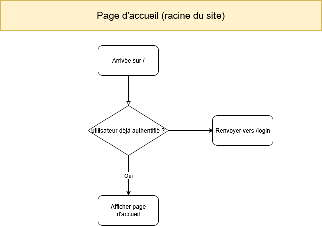
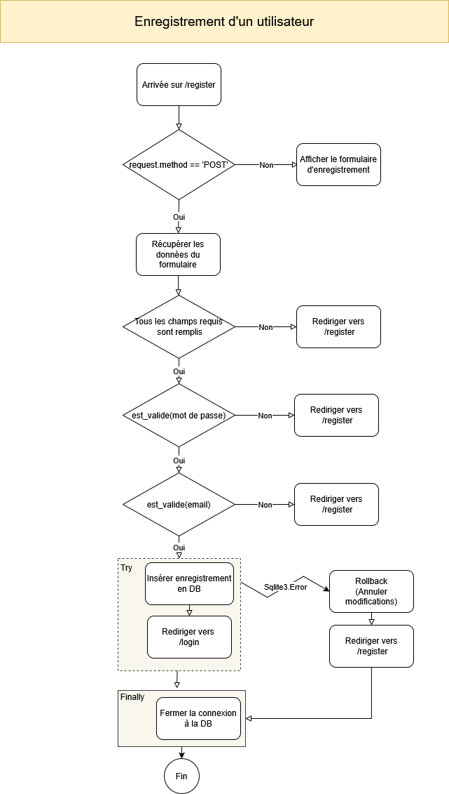

Cette section décrit l'organisation générale de routes qui gèrent l'enregistrement et l'authentification des utilisateurs.
## Page principale
### Route ('/')
Créer une route qui :
- Si l'utilisateur est déjà authentifié; le redirigera vers une page d'accueil personnalisée.
- Sinon,  le renverra vers la page de login.
## Enregistrement d'un utilisateur
### Route ('/register')
Créer une route qui, au départ de `/register` distinguera deux cas :
- Soit on désire afficher le formulaire (il s'agira alors d'une requête `GET`) : on renverra alors le template qui contient le formulaire.
- Soit on désire valider les données reçues du formulaire (il s'agira alors d'une requête `POST`)... à condition bien sûr, de l'avoir bien spécifié dans l'attribut `'action='POST'` de la balise `<form>`  
#### Validation des données du formulaire
1. Récupérer la valeur de chaque champ du formulaire dans une variable
   Eg : `password = request.form.get('password')` où l'argument 'password' correspond à la valeur de l'attribut de `name` de la balise `<input>` correspondante dans le formulaire.
2. Vérifier que toutes les valeurs requises ont bien été remplies dans le formulaire.  Si ce n'est pas le cas, renvoyer vers `/register`
3. Vérifier que les contraintes sur les valeurs de chaque champ est respectée (eg. taille,...).  En particulier; on s'assurera que la complexité du mot de passe correspond bien aux règles du cahier des charges; et que l'adresse email transmise est bien une adresse email valide.
   **Conseil** : pour ces deux derniers cas; on utilisera pour chacune une fonction Python qui retournera `True` si la valeur transmise est conforme; et `False` sinon.
3. Si l'une des données transmises ne correspond pas aux règles ou est manquante; on renverra l'utilisateur vers le formulaire d'enregistrement.
4. Si toutes les données transmises sont valides; on insérera les données en base de donnée.
   **Tip** : on utilisera un block `try... except:` qui 
	1. Si le bloc `try:` réussi sans lever d'erreur; aura ajouté l'enregistrement en DB, et renverra vers l'adresse `/login`
	2. S'il échoue : rétablira la DB dans son état initial (pré-ajout) et retournera vers la page d'enregistrement `/register`

# Flowchart (diagramme de flux)
Une autre façon, plus visuelle de se représenter les étapes du traitement des données; est de les représenter à l'aide d'un diagramme de flux.

## Pour la page principale

## Pour l'enregistrement d'un utilisateur

