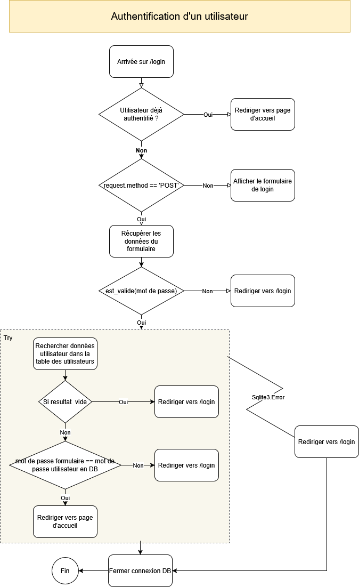

## Authentification de l'utilisateur
### Route ('/login')
Créer une route qui, au départ de `/login` distinguera deux cas :
- Soit on désire afficher le formulaire de login.
  Par exemple : 
	- quand la route a été invoquée depuis la barre d'adresse (url : http://127.0.0.1:5000/login)
	- ou quand on renvoie vers cette adresse; par exemple, depuis une URL dans un template
	- ou depuis une fonction dans notre contrôleur : `return url_for('/login')`
  Dans ce cas, il s'agira d'une requête `GET` et vous distinguerez deux cas :
	- Soit l'utilisateur est déjà authentifié; et vous le renvoyez vers une page d'accueil personnalisée.
	- Soit l'utilisateur n'est pas authentifié; et vous lui renvoyez un formulaire de login.
- Soit on reçoit des informations transmises depuis le formulaire de login
  Dans ce cas, on s'assurera qu'il s'agit d'une requête `POST`; et vous traiterez alors les données transmises par le formulaire afin d'authentifier l'utilisateur.
#### Authentification de l'utilisateur
- Etape 1 : vérifier si le mot de passe reçu via le formulaire est conforme aux règles de complexité du mot de passe définies dans le cahier des charges.
  S'il ne remplit pas les critères de complexité; renvoyer vers le formulaire de login.
  **Rem** : la meilleure façon de procéder est de déléguer cette tache à une fonction que vous aurez créée et qui renverra un booléen : `True` est cas de succès; `False`, sinon.
- Etape 2 : vérifier si l'utilisateur existe dans la base de données et si le mot de passe fourni correspond à celui enregistré pour cet utilisateur.
	- Si l'utilisateur n'existe pas; on retournera vers la page de login (`/login`)
	- Si l'utilisateur existe; on vérifiera si le mot de passe transmis correspond à celui enregistré pour cet utilisateur.
		- Si le mot de passe est incorrect; on retournera vers la page de login (`/login`)
		- Si le mot de passe est correct; on enregistrera l'identifiant de l'utilisateur dans un objet de session afin qu'il n'aie plus à se réauthentifier à chaque requête.
- Etape 4 : renvoyez vers `/login` (ce qui, puisque l'utilisateur est désormais authentifié; le renverra vers la page d'accueil personnalisée)

# Flowchart (diagramme de flux)

